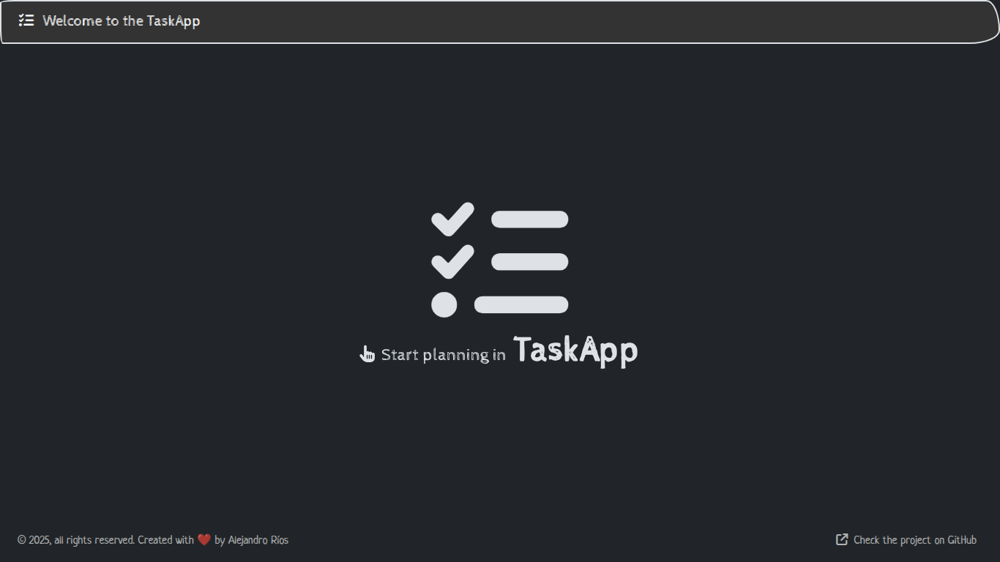

# Task App

Monorepo para la aplicación de gestión de tareas, compuesto por un frontend en React, un backend en Express y paquetes compartidos. Administrado con **Turborepo**, formateado con **Prettier** y verificado con **Commitlint** + **Husky**.



## Estructura del proyecto

```
.
├── apps
│ ├── task-app # Frontend en React
│ └── task-app-api # Backend en Express
├── packages
│ ├── shared # Código compartido (validaciones, utilidades, tipos comunes)
│ └── typescript-config # Configuración base de TypeScript
```

## Requisitos

- Node.js 18 o superior

## Instalación

1. Clona este repositorio:

```bash
git clone https://github.com/riversdev/task-app.git
cd task-app/
```

2. Instala las dependencias:

```bash
npm install
```

3. Crea los archivos `.env` de cada aplicación.

## Scripts disponibles

- `npm run dev`: Ejecuta el entorno de desarrollo de todos los paquetes.
- `npm run format`: Formatea el código de todos los paquetes.
- `npm run build`: Compila todos los paquetes.
- `npm run preview`: Previsualiza el build de producción de todos los paquetes.

## Aplicaciones

### apps/task-app

Ver [frontend readme](apps/task-app/README.md) para más detalles.

### apps/task-app-api

Ver [backend readme](apps/task-app-api/README.md) para más detalles.

## Paquetes compartidos

### packages/shared

Contiene funciones reutilizables, esquemas de validación con Zod, y tipos comunes utilizados por el frontend y el backend.

### packages/typescript-config

Contiene configuraciones base de TypeScript para asegurar consistencia en todo el monorepo.
